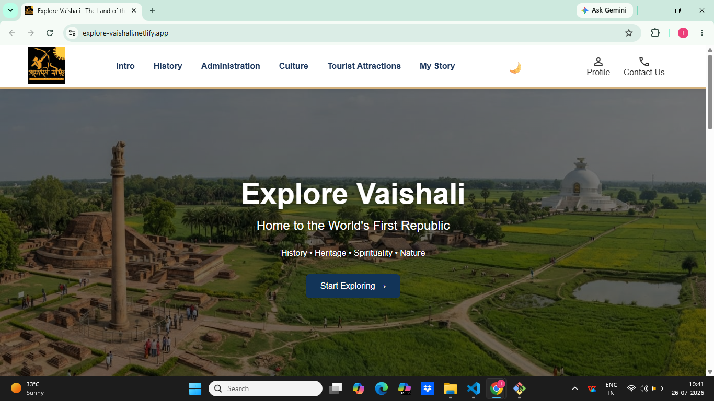
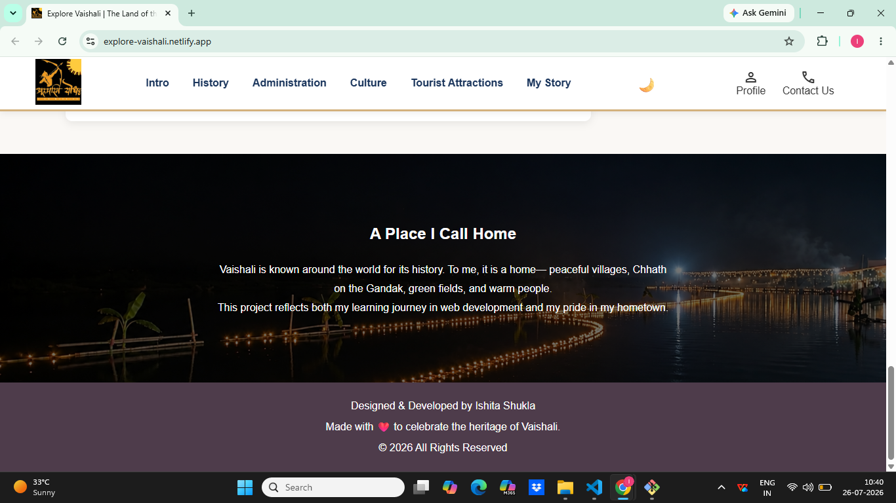
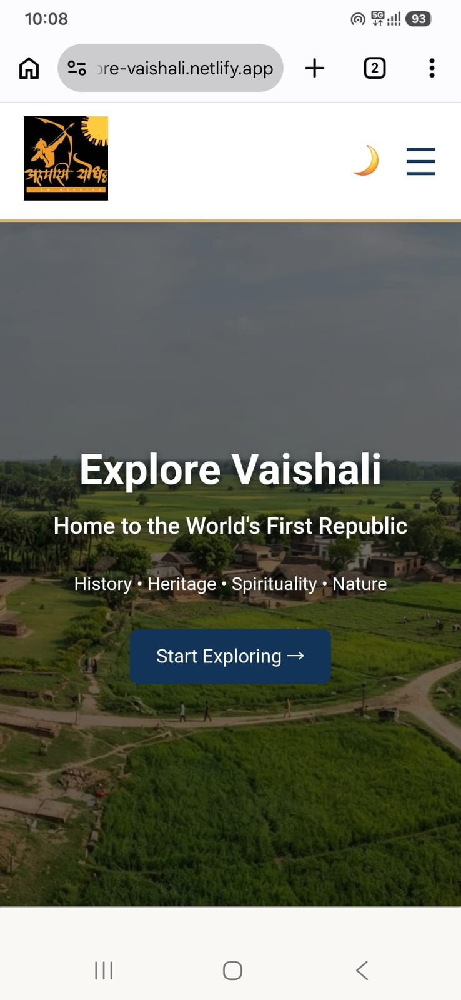

# Explore Vaishali

A responsive website showcasing the history, culture, heritage, and tourist attractions of Vaishali, Bihar. This project was built using HTML, CSS, and JavaScript as part of my web development learning journey.

## 🌐 Live Demo

https://explore-vaishali.netlify.app/

## ✨ Features

- Fully responsive design for desktop and mobile devices
- Dark mode toggle
- Mobile-friendly hamburger navigation 
- Personalized "My Story" section inspired by my hometown
- Clean and modern user interface
- Deployed on Netlify

## 🛠️ Tech Stack

- **HTML5** - Semantic webpage structure
- **CSS3** - Styling, Flexbox, Responsive Design, Dark Mode
- **JavaScript (ES6)** - DOM Manipulation and Interactive Features
- **Git** - Version Control
- **GitHub** - Source Code Management
- **Netlify** - Deployment and Hosting

## 📂 Project Structure

```text
explore-vaishali/
│── images/
│── index.html
│── style.css
│── script.js
│── README.md
```

## 📸 Screenshots

### Desktop View



### Dark Mode



### Mobile View



## 🚀 Run Locally

1. Clone the repository

```bash
git clone https://github.com/Ishitashukla08/explore-vaishali.git
```

2. Open the project folder.

3. Launch `index.html` in your web browser.

## 👩‍💻 Author

**Ishita Shukla**

- GitHub: https://github.com/Ishitashukla08
- LinkedIn: www.linkedin.com/in/ishitashukla333